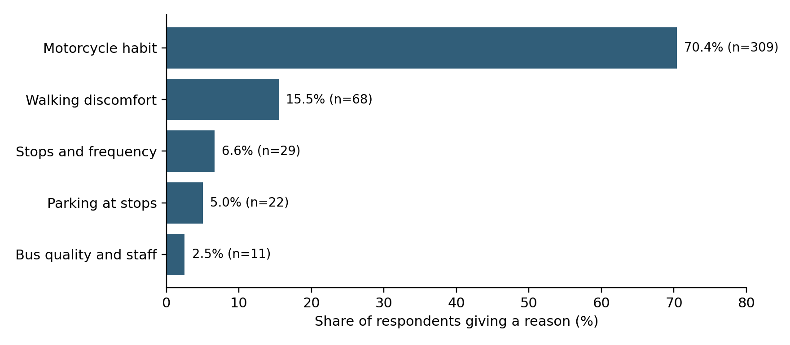

# Abstract {.unnumbered}

Proximity to a public transport stop measures only part of the conditions under which people decide to travel. This study examines stated barriers and mapped bus access before Metro Line 1 opened in Ho Chi Minh City. We link 450 source-verified respondents from a 2023 urban living lab survey to historical OpenStreetMap data. The analysis preserves five barrier categories and distinguishes bus-location proximity from network distance and walking comfort. Among 439 respondents giving a reason for non-use, 309 selected motorcycle habit and 68 selected walking discomfort. The median proximity difference for walking discomfort versus other reasons was 7 m (spatial-block 95% interval -72 to 153 m); the corresponding network-distance difference was 4 m (-139 to 192 m). These estimates do not establish equivalence between groups or identify the cause of non-use. A later map snapshot tests sensitivity to mapping coverage, rather than measuring infrastructure delivery or behavioural change. The contribution is a reproducible procedure for aligning survey constructs, map definitions and policy claims. Short mapped distances cannot dismiss reported discomfort, while a single habit response cannot establish that infrastructure investment is ineffective. First-mile planning should combine historical network evidence with direct assessment of walking conditions and service quality.

Keywords: public transport; stated barriers; walking access; historical OpenStreetMap; motorcycle use; Vietnam

# Introduction

Improving public transport requires understanding both the transport opportunities available to people and the conditions under which they can use them. Accessibility research has long distinguished access to opportunities from movement itself, and has shown that the choice of an indicator shapes the diagnosis of a transport problem (Geurs and van Wee, 2004; Handy and Niemeier, 1997). Nevertheless, a short distance to a stop is easily interpreted as evidence that an access problem has been solved. This interpretation becomes especially consequential when a resident reports an impediment that a map does not measure.

Ho Chi Minh City offers a relevant setting for examining this problem. Research on mobility in Vietnamese cities situates motorcycle travel within social practices and aspirations, rather than treating vehicle use as a response to travel time alone (Truitt, 2008; Hansen, 2017). Local studies have examined psychological determinants of bus-use intention, preferences involving new transport modes, and the potential shift from motorcycles to public transport (Fujii and Van, 2009; Nguyen et al., 2019; Nguyen et al., 2024). These perspectives make it important to distinguish what people report, what spatial indicators represent and what either source can establish about policy.

The Truong Tho Living Lab collected resident responses in 2023, before Metro Line 1 commenced commercial operation on 22 December 2024 (Japan International Cooperation Agency, 2024). The questionnaire asked which transport modes respondents used and required one answer to a question about reasons for not using public transport. The choices included motorcycle habit, discomfort walking to stops, insufficient stops and frequency, inadequate parking, and bus quality and staff conduct. These categories refer to different dimensions of a journey. Their relationship to a common distance indicator is therefore an empirical question, not a contest in which either survey or map must be correct.

This article makes a bounded contribution to transport policy diagnosis. It links those responses to historical bus-location and street-network data while auditing the survey denominator, the transport features admitted to the map and the assumptions needed to compute a walking route. The historical perspective matters because a facility can be mapped before it opens, and a later mapping edit can alter a distance without any corresponding change in service. The contribution is not a causal estimate of metro impacts, a citywide modal-share estimate or a test that infrastructure does not matter.

Three questions organise the analysis. First, which reasons were recorded among respondents with traceable source records, and how should their percentages be interpreted? Second, how do historically mapped distances vary across those reasons, particularly between respondents reporting walking discomfort and those giving other reasons? Third, how sensitive are the comparisons to the definition of a bus location, network connection rules and the cohort included? These questions support a practical distinction between an access indicator and the wider service problem it is sometimes asked to represent.

# Conceptual framework

## Calculated access and reported experience

Calculated and perceived accessibility are related but non-identical constructs. Pot and colleagues explain why mismatches may arise from awareness and from the inability of an indicator to represent subjective evaluations (Pot et al., 2021). Work developing and applying the Perceived Accessibility Scale makes the individual experience of access an explicit object of measurement (Lättman et al., 2016; Lättman et al., 2018). The present questionnaire does not contain that scale. A selected reason for non-use should therefore not be relabelled as a validated measure of perceived accessibility.

The distinction also concerns the policy objective. Accessibility research identifies challenges in connecting indicators to the questions that planning should answer (van Wee, 2016), while research on accessibility planning asks whether operational practice addresses what matters to users (Curl et al., 2011). A distributive perspective further requires attention to who can benefit from a transport system rather than relying only on average provision (Pereira et al., 2017). In this study, distance is interpreted as one component of first-mile access. It does not incorporate destinations, timetable connectivity, monetary costs or a person's ability to complete the trip.

## Habit as a response rather than an established mechanism

Theories of planned behaviour and research on repeated action provide reasons to study intentions, attitudes and habitual processes together (Ajzen, 1991; Aarts et al., 1998; Bamberg et al., 2003). However, the word habit in a response option is not interchangeable with a measured psychological construct. The Self-Report Habit Index and subsequent work on automaticity explicitly use measurement instruments that are absent here (Verplanken and Orbell, 2003; Gardner et al., 2012). We consequently refer to a habit response or stated motorcycle habit, not an independently established level of automaticity.

Travel research has examined habit and motivation in stable contexts, experimental disruption through a free bus ticket, and the role of behavioural measures in transport policy (Gardner, 2009; Fujii and Kitamura, 2003; Bamberg et al., 2011). Other work cautions against oversimplifying habits and the direction of relationships between attitudes and behaviour (Schwanen et al., 2012; Kroesen et al., 2017). Instrumental, symbolic and affective motives can also coexist (Steg, 2005). These contributions support treating a single selected response as a limited description. They do not justify interpreting its prevalence as the share of a population whose behaviour is immune to infrastructure improvement.

## Distance is not walking comfort

Built-environment research relates travel to density, diversity and design, while broader synthesis documents variation across transport and land-use measures (Cervero and Kockelman, 1997; Ewing and Cervero, 2010). For walking, the relevant attributes extend beyond proximity: environmental correlates, urban design qualities and the hierarchy of walking needs all identify reasons why similar distances can be experienced differently (Saelens et al., 2003; Ewing and Handy, 2009; Alfonzo, 2005). Operational reviews of active accessibility and work on non-motorised access likewise show that measurement choices require explicit justification (Vale et al., 2015; Iacono et al., 2010).

Empirical research on distances to transit stops cautions against treating one fixed catchment as universally representative (El-Geneidy et al., 2014). In Ho Chi Minh City, the multiple uses of sidewalks also make the street edge more than a neutral movement corridor (Kim, 2012). A mapped route does not verify an unobstructed sidewalk, safe crossing, shade or a suitable surface. A lack of a detected distance difference therefore cannot reclassify walking discomfort as merely perceptual. Conversely, a difference in distance would not by itself establish that distance caused the response.

## Historical maps as partial evidence

OpenStreetMap is a form of volunteered geographic information whose utility depends on how contributors record the world (Goodchild, 2007; Neis and Zipf, 2012). Research on its accuracy and road completeness provides a basis for using it critically, not a guarantee that every local transport feature is complete or operational (Haklay, 2010; Barrington-Leigh and Millard-Ball, 2017). Reproducible street-network analysis makes such definitions inspectable (Boeing, 2017). Our analysis uses a custom extraction with explicit feature and access rules; it does not imply that a software package can substitute for a local service inventory.

This framework generates a modest expectation: different reasons may overlap in mapped distance because they concern partially different dimensions of access. The analysis estimates that overlap and its uncertainty. It does not assume in advance that overlap will occur, that the groups are equivalent, or that an observed mismatch identifies which policy instrument should receive the largest budget.

# Study setting and data

Figure 1 locates the historical bus map and survey coverage in eastern Ho Chi Minh City, southern Vietnam. Survey locations are displayed only as centres of 500 m cells containing at least five source-linked respondents; smaller cells are suppressed. Symbol sizes represent cell counts, not individual addresses. The archived Truong Tho outline and Metro Line 1 alignment provide geographic context only. Their dates are not independently certified as 2023 boundaries or infrastructure states, and neither layer enters distance calculations.

## Survey provenance and analytical population

The resident questionnaire belongs to a wider urban living lab programme centred on Truong Tho in the then Thu Duc City. Respondents also lived in adjoining and other wards. The analysis treats the sample as an observational local case, with no probability-sampling weights or claim of representativeness for Ho Chi Minh City. The available source export contains 450 resident records. The cleaned workbook contains 460, of which 450 can be linked to that export by timestamp. The ten additional cleaned records are retained only in a sensitivity analysis pending reconciliation of their provenance.

The main analysis uses the source-linked cohort and checks the original response fields against the cleaned file. Where transport-response text differs, the source export takes precedence for the verified cohort. The transport-mode, barrier, income and education fields match the source export for all 450 linked records; no replacement of those values was required. Timestamps document data entry between 19 March 2023 and 09 April 2023; they are not independent evidence of each interview's field date. The study is described as a 2023 survey, not as a panel or an immediately pre-opening evaluation.

The analytical denominator changes with the question. Mode reporting uses all 450 source-linked records. Barrier comparisons exclude 11 respondents whose recorded answer says they use public transport, leaving 439 reason-givers. Geographic analysis further requires coordinates within the extraction region. 449 verified records meet that rule, of which 438 give a reason. Network comparisons may contain fewer observations because not every location can be connected under the specified rule. Table 1 states these denominators explicitly.

Table: Analysis populations

| Stage | Records |
| --- | --- |
| Clean resident workbook | 460 |
| Source-linked main cohort | 450 |
| Main cohort with valid coordinates | 449 |
| Main cohort giving a substantive reason | 439 |
| Geolocated main-cohort reason-givers | 438 |
| Network comparison with 100 m connectors | 437 |

The ten unlinked cleaned records enter sensitivity analyses only. Network availability is determined separately from coordinate validity.

## Questionnaire interpretation

The mode item asks which modes the respondent uses in the city and explicitly permits more than one answer. A report of motorcycle use is therefore not a trip share or necessarily a principal mode. The barrier item requests one answer. It cannot measure all simultaneous barriers or rank the importance of unselected alternatives. Moreover, the stop option combines stop numbers and service frequency, although the map measures only the spatial component.

The archived questionnaire lists five reasons. The response export additionally contains the answer that the person uses public transport. We preserve that answer and report it separately rather than forcing it into a barrier category. The apparent inconsistency across items is informative about measurement limits: listing bus use and declining to give a non-use reason are not interchangeable definitions of a public transport user. Neither should be used to infer a validated frequency of travel.

Demographic covariates are age in 2023, recorded gender and household income band. For exploratory adjusted associations, the sparse upper income categories are combined into an above-VND-15-million group, compared with below VND 5 million and VND 5–15 million. Income is treated categorically. No coefficient is interpreted as an affordability mechanism, and no household is assumed to have the same disposable resources simply because it belongs to the same band.

## Public data and temporal alignment

The core public source is the historical Vietnam OpenStreetMap extract labelled 1 January 2023, with a second extract labelled 1 January 2026 used as a mapping-sensitivity comparison (Geofabrik, 2026). File hashes and extraction rules accompany the analysis. Coordinates are projected to UTM zone 48N, and the extraction window is 106.66–106.85°E and 10.74–10.92°N. This window is a computational boundary, not a definition of the sampled population or the administrative extent of Truong Tho.

Bus candidates are features explicitly tagged as bus stops, bus stations or bus-related transport objects. Rail station, halt, stop, proposed and construction features are excluded from this bus set, as are records explicitly marked inactive or inaccessible under the implemented rules. Identical coordinate pairs are collapsed. A narrower sensitivity definition admits only highway=bus_stop. The resulting objects are mapped bus locations, not a verified register of operational stops. The available files do not provide a validated historical timetable, service-frequency series or complete record of opening dates.

The 2026 extract cannot explain a response made in 2023. Its role is to show how much a diagnostic result can depend on the map version and tagging definition. The study does not estimate before–after ridership, mode switching or the effect of Metro Line 1. Population projections, satellite built-up indices and provincial business rankings are omitted from the main design because they do not directly resolve the relationship between a selected travel barrier and first-mile access.

# Methods

Figure 2 illustrates the routing procedure on the extracted 2023 graph. The origin is synthetic, selected solely from public street geometry; it is not a displaced or identifiable survey household. The straight-line nearest stop and network-optimal stop need not be the same. Dotted connectors join endpoints to their nearest admissible graph nodes within 100 m; they are geometric approximations, not verified footpaths. The continuous route is the shortest mapped path under the implemented rules, not an observed or field-validated walking route.

![Network construction on actual 2023 OSM geometry using a synthetic origin, not a survey household. The dashed line reaches the nearest mapped stop; the solid line follows the shortest admissible graph route plus dotted endpoint connectors. Each connector is limited to 100 m. The circle shows the origin limit, not a transit catchment. The two measures can select different stops. Neither the graph route nor connectors establish sidewalk quality or an observed walking route. Source: OpenStreetMap contributors.](figures/Figure2_network_method.png)

## Proximity and network construction

Straight-line distance is the minimum projected distance from each valid respondent coordinate to an eligible mapped bus location. We distinguish this measure from a walking route and from access to destinations through public transport. Exact-coordinate duplicates do not affect the minimum distance. Counts of candidate features and clusters within 50 m are provided to show that mapped objects should not automatically be counted as distinct service stops. Cluster counts do not enter the distance calculation.

The walking graph retains original OpenStreetMap node identifiers. Consecutive nodes on an admitted way become undirected edges weighted by projected length; coincident coordinates with different identifiers are not automatically joined. This avoids manufacturing connections at grade-separated crossings. The admitted highway classes cover pedestrian paths and ordinary streets, while cycleways require an explicit permissive foot tag. Ways tagged foot=no or foot=private are removed. General access restrictions are also respected unless an explicit permissive pedestrian tag overrides them.

Both origins and bus locations are connected to the nearest eligible graph node. The primary connector limit is 100 m, with 250 m as a sensitivity analysis. These connectors approximate missing access segments; they do not establish a legal passage through a wall or across private land. A multi-source shortest-path calculation finds the nearest reachable bus location, including connector lengths. Unreachable origins remain missing rather than being replaced with straight-line distances. The graph represents plausible mapped connections, not an audited pedestrian environment.

## Descriptive comparisons and uncertainty

We retain the five substantive response categories throughout. Proportions are accompanied by Wilson intervals (Wilson, 1927), interpreted as descriptive uncertainty under a simple binomial model rather than design-based population intervals. Distance distributions are reported as medians and interquartile ranges. Exploratory Kruskal–Wallis comparisons are supplied with effect-size estimates and Holm adjustment across the six distance specifications (Holm, 1979). Because those tests do not account fully for spatial dependence or the non-probability sample, they do not carry the primary interpretation.

The principal targeted comparison is the median distance among respondents selecting walking discomfort minus the median among respondents giving another substantive reason. To retain some local dependence, we resample occupied 500 m projected grid cells with replacement, keeping all observations within each selected cell. Percentile intervals use 1,999 resamples and a fixed random seed. These intervals describe sampling variability conditional on the observed cohort and grid. They cannot account for missing survey coverage, unknown route quality or uncertainty in the map itself.

Two exploratory binomial models examine walking discomfort and the habit response separately. Each relates the response to log2(1 + distance/100), age, recorded gender and the three income groups. Standard errors are clustered by the same grid cells. The transformed distance coefficient refers to a doubling of the quantity 1 + distance/100, not a constant change per 100 m. Complete-case denominators and cell counts are reported. The models describe conditional association; they do not identify a behavioural mechanism or predict a post-metro outcome.

## Sensitivity and interpretation rules

Sensitivity checks vary the bus-feature definition, connector threshold, map year and inclusion of all 460 cleaned records. A further restriction retains only source-verified residents reporting a Truong Tho home address. This last comparison addresses the geographic breadth of recruitment without claiming to make the sample representative. Network missingness is shown alongside results so that a change in the estimated distribution is not silently attributed only to a change in the metric.

We do not interpret a large p-value as proof of no relationship (Wasserstein and Lazar, 2016). Equivalence would require defensible bounds and an appropriate design, not merely failure to reject a conventional null (Lakens, 2017). More generally, spatial dependence limits the independence assumptions behind ordinary validation and uncertainty procedures (Roberts et al., 2017). These rules are particularly relevant where a small response category is compared with a much larger habit group. The analysis was developed retrospectively and is not described as preregistered.

# Results

## Recorded modes and reasons

In the verified cohort, 376 of 450 respondents (83.6%) report using a private motorcycle, and 8 (1.8%) report bus use. These are person-level reports, not shares of trips. The non-use item contains 11 responses stating that public transport is used, of which 1 also list the bus in the mode item. The difference between the two items prevents a simple equation of their user denominators.

Among the 439 reason-givers, motorcycle habit is the most frequent answer (309, 70.4%), followed by walking discomfort (68, 15.5%). Stops and frequency account for 29 responses, parking at stops for 22 and bus quality and staff for 11. Table 2 reports percentages both among all verified respondents and among reason-givers. The categories remain separate: walking discomfort is not added to habit, and no behavioural-to-infrastructure ratio is used as an estimate of policy need.

Table: Recorded reasons and denominators

| Recorded answer | n | All respondents % | Reason givers % |
| --- | --- | --- | --- |
| Motorcycle habit | 309 | 68.7 | 70.4 |
| Walking discomfort | 68 | 15.1 | 15.5 |
| Stops and frequency | 29 | 6.4 | 6.6 |
| Parking at stops | 22 | 4.9 | 5.0 |
| Bus quality and staff | 11 | 2.4 | 2.5 |
| Reports using public transport | 11 | 2.4 | Not included |

The item permits one answer. The public-transport-use answer is retained separately and excluded from reason-group comparisons.

## What the historical map contains

The 2023 extraction yields 836 unique eligible mapped bus locations, compared with 2,241 in 2026. Restricting the definition to highway=bus_stop retains 808 and 2,207, respectively. The 50 m clustering diagnostic produces 694 and 1,674 clusters. These differences show the importance of the admitted tags and the map date; neither feature counts nor clusters are interpreted as numbers of operating routes or services. The 2023 walking graph contains 221,703 nodes and 241,398 edges across 1,455 connected components. Access rules exclude 473 otherwise eligible ways.

Table: Historical mapping and feature definitions

| Indicator | 2023 | 2026 |
| --- | --- | --- |
| Eligible feature records | 836 | 2241 |
| Unique coordinate pairs | 836 | 2241 |
| Highway bus stop locations | 808 | 2207 |
| Clusters at 50 m | 694 | 1674 |

Counts describe map objects under extraction rules, not verified operational stops. Source: © OpenStreetMap contributors; historical extracts from Geofabrik.

The distinction between mapped locations and operating services remains important after filtering. Explicit bus tags improve mode specificity, but do not verify that a vehicle called at a location at the survey date. Similarly, removing a prohibited edge does not confirm that the remaining route is comfortable or safe. The public data add reproducible spatial evidence while leaving several dimensions of the questionnaire unmeasured.

## Distance distributions and walking discomfort

Mapped proximity is available for 438 source-verified reason-givers, while the 100 m connector network specification retains 437. Figure 3 displays the empirical distributions rather than only their averages. The exploratory five-group Kruskal–Wallis statistic is 9.47 for proximity (unadjusted p=0.050, Holm-adjusted p=0.302, epsilon-squared=0.013). For network distance the corresponding values are 6.97, p=0.138, adjusted p=0.551 and epsilon-squared=0.007. These tests describe the observed groups; their ordinary independence assumption limits their inferential role.

Table: Distance by recorded reason

| Reason | n | Proximity m | n | Network m |
| --- | --- | --- | --- | --- |
| Motorcycle habit | 309 | 265 [123–479] | 308 | 398 [207–803] |
| Walking discomfort | 68 | 282 [141–549] | 68 | 428 [208–823] |
| Stops and frequency | 29 | 413 [237–651] | 29 | 551 [370–1,005] |
| Parking at stops | 21 | 290 [210–599] | 21 | 415 [261–877] |
| Bus quality and staff | 11 | 199 [172–368] | 11 | 436 [297–594] |

Distances are medians [interquartile range]. Network distances use a 100 m maximum connector at both endpoints. The samples differ where routing is unavailable.

For mapped proximity, the walking-discomfort group has a median of 282 m, compared with 274 m for other reason-givers. The unadjusted median contrast is 7 m, with a 95% spatial-block interval from -72 to 153 m based on 61 occupied cells. For network distance the medians are 428 and 424 m, giving a contrast of 4 m (interval -139 to 192 m). The interval widths, rather than a binary significance label, express the uncertainty relevant to a distance-based diagnosis.

Table: Walking discomfort versus other reasons

| Measure | n walking | n other | Median difference m | 95% block interval m |
| --- | --- | --- | --- | --- |
| Proximity | 68 | 370 | 7 | -72 to 153 |
| Network 100 m | 68 | 369 | 4 | -139 to 192 |

Positive differences indicate greater distance among respondents reporting discomfort. Intervals use 1,999 resamples of occupied 500 m grid cells; they are conditional on the observed non-probability sample.

## Adjusted associations and sensitivity

For walking discomfort, the adjusted odds ratio for a one-unit increase in log2(1 + distance/100) is 1.10 (cluster-adjusted 95% interval 0.76–1.58; n=438, 61 spatial cells). For the habit response, the adjusted odds ratio for a one-unit increase in log2(1 + distance/100) is 0.77 (cluster-adjusted 95% interval 0.58–1.03; n=438, 61 spatial cells). These secondary models describe distance–response association conditional on age, recorded gender and income group. They do not establish whether respondents can afford an alternative or whether a change in distance would alter their behaviour.

Including all cleaned records yields 445 geolocated reason-givers; restricting to verified Truong Tho residents yields 245. The five-category proximity comparisons have unadjusted p=0.070 and p=0.016, respectively. The within-ward comparison provides more evidence of differentiation than the full-sample comparison, although it remains exploratory. It would therefore be inaccurate to describe all specifications as uniformly null. The sensitivity tables also show results for highway-only bus locations, a 250 m connector limit and the 2026 map. These specifications are reported together rather than selecting whichever comparison produces the strongest association. In particular, the later map remains a measurement sensitivity, not a historical exposure for the 2023 response.

These comparisons concern correspondence between recorded responses and constructed indicators. The network and straight-line samples are not identical where routing fails. A change across specifications can therefore reflect both a different exposure definition and selection into the routable subset. The supplementary tables provide denominators for every specification, along with full coefficient estimates and the cohort restrictions.

# Discussion

## What the combined evidence contributes

The analysis contributes a disciplined link between a legacy survey and public spatial data. The two sources answer different questions: the survey records one selected account of non-use, while the map describes certain spatial opportunities available under explicit definitions. Combining them makes those differences visible. It does not make the map a complete external criterion against which a resident's account can be declared accurate or mistaken.

This distinction changes the practical reading of a frequent habit response. The response identifies a useful subject for follow-up, but it does not allocate a causal share of non-use to habit. Service limitations, parking arrangements and familiar routines may coexist. An individual can have adopted a motorcycle routine partly because the alternatives have been inconvenient. The cross-sectional data cannot establish the temporal sequence. Studies of built-environment relationships and residential self-selection underline the broader difficulty of separating association, selection and causation (Handy et al., 2005; Cao et al., 2009).

The same reasoning applies to walking discomfort. Two residents with similarly short mapped routes may face different crossings, mobility limitations, exposure to heat or constraints on accompanying children. Those are hypotheses requiring direct observations; they are not findings of this dataset. Their plausibility explains why a distance comparison cannot settle the physical-versus-perceptual status of the reported barrier. The empirical contribution is to show what the available indicator can test and where further diagnosis is necessary.

## Implications for first mile policy

The results support a staged diagnostic approach. First, establish which locations were mapped as bus-related at the relevant date and how residents can reach them under transparent network assumptions. Second, investigate the actual content of a reported impediment. A combined stops-and-frequency answer requires both a spatial inventory and service information. A parking answer requires an assessment of parking availability, cost and security. A discomfort answer requires observation of the walking environment and the user's needs. These are different follow-up tasks, even when the same stop serves the respondents.

Third, connect the diagnosis to a testable intervention rather than inferring effectiveness from the prevalence of a reason. Behavioural measures can be combined with improvements in access and service; sustainable mobility is not reducible to one instrument (Banister, 2008). Evidence on electric-bus intentions in Vietnam also situates vehicle innovation within a wider set of user concerns (Nguyen and Pojani, 2023). The present study cannot estimate the effect of an information campaign, additional parking or a new feeder service. It helps specify what would need to be measured to evaluate each of them.

A useful follow-up design would repeat the relevant questions while collecting actual trip frequency, multiple concurrent barriers, perceived-accessibility items and a short route audit. The repeat should distinguish existing bus use from metro uptake and retain the ability to link records only where consent permits. Public timetables or an independently verified service inventory would allow an analysis of waiting time and destination access. These additions would address identifiable measurement gaps, rather than simply enlarging the set of remote-sensing covariates.

## Reusing historical data without creating a false before and after study

The value of the 2023 survey is that it records responses before metro operation. That does not make it a quasi-experiment. A second map is not a second behavioural wave, and a station's presence in an early map does not establish that it was available for passenger use. Retaining these distinctions prevents a baseline archive from being stretched into an impact evaluation it cannot support.

The later snapshot remains useful for an auditable reason: it tests how a spatial description changes when coverage and tags change. Policy analysts often work with whatever map is currently downloadable. For a historical survey, this can create a temporal mismatch that is difficult to detect once derived distances have been saved. Keeping source filenames, hashes, extraction rules and dates with the analysis makes the mismatch reviewable. For operational decisions, however, even a reproducible map should be checked against the service that passengers actually encounter.

## Limitations and scope of transfer

Several limitations bound the contribution. The local cohort is not a probability sample, and the ten additional cleaned records have not yet been reconciled to the available source export. Timestamp matching improves provenance but does not independently verify interview conduct or recruitment. The sensitivity analysis indicates how inclusion changes the observed results; it cannot resolve the missing documentation. Source records and coordinates remain restricted because they contain identifying information.

The single-choice barrier item is coarse and combines concepts that should be measured separately. The mode question does not record trip counts, and public transport use is inconsistently represented across items. The study therefore cannot estimate modal share, a dose of habit, or the prevalence of every barrier. Small categories also limit precision and the complexity of an appropriate adjusted model.

The OSM feature set has incomplete service metadata. Nearest-node connectors approximate access rather than observe it; the graph excludes explicit prohibitions but cannot recover untagged restrictions. Finite extraction boundaries and disconnected components can affect routes. The 100 m and 250 m checks expose part of this sensitivity without validating all possible paths. No route-level comfort, fares or historical headways are measured.

Finally, the findings are observational. Spatial block resampling and clustered standard errors address only part of the dependence problem and do not remove confounding or selection. Transfer to other cities concerns the measurement and audit procedure, not the numerical response shares. The appropriate general claim is that a planning diagnosis should match each indicator to the construct it can measure and retain unresolved dimensions as explicit evidence needs.

# Conclusion

Linking a 2023 resident survey to historical public maps provides a useful but bounded account of first-mile access in a motorcycle-oriented urban setting. The revised analysis preserves the original barrier categories, uses a source-traceable main cohort and makes bus-feature and walking-network definitions explicit. It also reports uncertainty and sensitivity instead of treating a non-significant comparison as a proof of equivalence.

The policy implication is a requirement for better diagnosis. A short route to a mapped bus location does not establish comfortable access, and a habit response does not establish that infrastructure is irrelevant. Historical survey evidence is most useful when it identifies which combinations of spatial access, service conditions and reported experience need to be examined together. Future evaluation should add verified service information and repeated behavioural observations before attributing change to metro operation or any associated intervention.

# Data and code availability

The revision package contains the analysis script, source-file hashes, aggregate tables, figure-generation code and bibliographic verification records. Source survey records and household coordinates are not included in the shareable outputs. Reproduction of the spatial analysis requires authorised access to the survey files and the named historical extracts. OpenStreetMap-derived data are credited to OpenStreetMap contributors and are subject to the Open Database Licence (OpenStreetMap contributors, 2026). No repository DOI or unrestricted microdata availability is claimed.

# Relationship to other manuscripts

This article is a secondary analysis of the 2023 Truong Tho Living Lab survey programme. Related manuscripts address stakeholder priority differences, spatial clustering of environmental appraisals, and flooding appraisals linked to environmental data. The present analysis focuses on transport-response interpretation and historically mapped bus access; it does not present the shared cohort as a new independent survey. Details of related submissions should accompany the editorial disclosure while preserving the journal's review anonymity requirements.

# References {.unnumbered}

Aarts, H.; Verplanken, B.; van Knippenberg, A. (1998). Predicting Behavior From Actions in the Past: Repeated Decision Making or a Matter of Habit? Journal of Applied Social Psychology, 28(15), 1355-1374. <https://doi.org/10.1111/j.1559-1816.1998.tb01681.x>

Ajzen, I. (1991). The theory of planned behavior. Organizational Behavior and Human Decision Processes, 50(2), 179-211. <https://doi.org/10.1016/0749-5978(91)90020-t>

Alfonzo, M.A. (2005). To Walk or Not to Walk? The Hierarchy of Walking Needs. Environment and Behavior, 37(6), 808-836. <https://doi.org/10.1177/0013916504274016>

Bamberg, S.; Ajzen, I.; Schmidt, P. (2003). Choice of Travel Mode in the Theory of Planned Behavior: The Roles of Past Behavior, Habit, and Reasoned Action. Basic and Applied Social Psychology, 25(3), 175-187. <https://doi.org/10.1207/s15324834basp2503_01>

Bamberg, S.; Fujii, S.; Friman, M.; Gärling, T. (2011). Behaviour theory and soft transport policy measures. Transport Policy, 18(1), 228-235. <https://doi.org/10.1016/j.tranpol.2010.08.006>

Banister, D. (2008). The sustainable mobility paradigm. Transport Policy, 15(2), 73-80. <https://doi.org/10.1016/j.tranpol.2007.10.005>

Barrington-Leigh, C.; Millard-Ball, A. (2017). The world’s user-generated road map is more than 80% complete. PLOS ONE, 12(8), e0180698. <https://doi.org/10.1371/journal.pone.0180698>

Boeing, G. (2017). OSMnx: New methods for acquiring, constructing, analyzing, and visualizing complex street networks. Computers, Environment and Urban Systems, 65, 126-139. <https://doi.org/10.1016/j.compenvurbsys.2017.05.004>

Cao, X.J.; Mokhtarian, P.L.; Handy, S.L. (2009). Examining the Impacts of Residential Self‐Selection on Travel Behaviour: A Focus on Empirical Findings. Transport Reviews, 29(3), 359-395. <https://doi.org/10.1080/01441640802539195>

Cervero, R.; Kockelman, K. (1997). Travel demand and the 3Ds: Density, diversity, and design. Transportation Research Part D: Transport and Environment, 2(3), 199-219. <https://doi.org/10.1016/s1361-9209(97)00009-6>

Curl, A.; Nelson, J.D.; Anable, J. (2011). Does Accessibility Planning address what matters? A review of current practice and practitioner perspectives. Research in Transportation Business & Management, 2, 3-11. <https://doi.org/10.1016/j.rtbm.2011.07.001>

El-Geneidy, A.; Grimsrud, M.; Wasfi, R.; Tétreault, P.; Surprenant-Legault, J. (2014). New evidence on walking distances to transit stops: identifying redundancies and gaps using variable service areas. Transportation, 41(1), 193-210. <https://doi.org/10.1007/s11116-013-9508-z>

Ewing, R.; Cervero, R. (2010). Travel and the Built Environment: A Meta-Analysis. Journal of the American Planning Association, 76(3), 265-294. <https://doi.org/10.1080/01944361003766766>

Ewing, R.; Handy, S. (2009). Measuring the Unmeasurable: Urban Design Qualities Related to Walkability. Journal of Urban Design, 14(1), 65-84. <https://doi.org/10.1080/13574800802451155>

Fujii, S.; Kitamura, R. (2003). What does a one-month free bus ticket do to habitual drivers? An experimental analysis of habit and attitude change. Transportation, 30(1), 81-95. <https://doi.org/10.1023/a:1021234607980>

Fujii, S.; Van, H. (2009). Psychological Determinants of the Intention to Use the Bus in Ho Chi Minh City. Journal of Public Transportation, 12(1), 97-110. <https://doi.org/10.5038/2375-0901.12.1.6>

Gardner, B. (2009). Modelling motivation and habit in stable travel mode contexts. Transportation Research Part F: Traffic Psychology and Behaviour, 12(1), 68-76. <https://doi.org/10.1016/j.trf.2008.08.001>

Gardner, B.; Abraham, C.; Lally, P.; de Bruijn, G.J. (2012). Towards parsimony in habit measurement: Testing the convergent and predictive validity of an automaticity subscale of the Self-Report Habit Index. International Journal of Behavioral Nutrition and Physical Activity, 9(1), 102. <https://doi.org/10.1186/1479-5868-9-102>

Geofabrik (2026). OpenStreetMap data extracts for Vietnam: historical files vietnam-230101.osm.pbf and vietnam-260101.osm.pbf. <https://download.geofabrik.de/asia/vietnam.html>

Geurs, K.T.; van Wee, B. (2004). Accessibility evaluation of land-use and transport strategies: review and research directions. Journal of Transport Geography, 12(2), 127-140. <https://doi.org/10.1016/j.jtrangeo.2003.10.005>

Goodchild, M.F. (2007). Citizens as sensors: the world of volunteered geography. GeoJournal, 69(4), 211-221. <https://doi.org/10.1007/s10708-007-9111-y>

Haklay, M. (2010). How Good is Volunteered Geographical Information? A Comparative Study of OpenStreetMap and Ordnance Survey Datasets. Environment and Planning B: Planning and Design, 37(4), 682-703. <https://doi.org/10.1068/b35097>

Handy, S.L.; Niemeier, D.A. (1997). Measuring Accessibility: An Exploration of Issues and Alternatives. Environment and Planning A: Economy and Space, 29(7), 1175-1194. <https://doi.org/10.1068/a291175>

Handy, S.; Cao, X.; Mokhtarian, P. (2005). Correlation or causality between the built environment and travel behavior? Evidence from Northern California. Transportation Research Part D: Transport and Environment, 10(6), 427-444. <https://doi.org/10.1016/j.trd.2005.05.002>

Hansen, A. (2017). Hanoi on wheels: emerging automobility in the land of the motorbike. Mobilities, 12(5), 628-645. <https://doi.org/10.1080/17450101.2016.1156425>

Holm, S. (1979). A Simple Sequentially Rejective Multiple Test Procedure. Scandinavian Journal of Statistics, 6(2), 65–70. <https://www.jstor.org/stable/4615733>

Iacono, M.; Krizek, K.J.; El-Geneidy, A. (2010). Measuring non-motorized accessibility: issues, alternatives, and execution. Journal of Transport Geography, 18(1), 133-140. <https://doi.org/10.1016/j.jtrangeo.2009.02.002>

Japan International Cooperation Agency (2024). Inauguration of Vietnam’s First Underground Urban Metro Line in Ho Chi Minh City. <https://www.jica.go.jp/english/information/press/2024/20241225_21.html>

Kim, A.M. (2012). The Mixed-Use Sidewalk: Vending and Property Rights in Public Space. Journal of the American Planning Association, 78(3), 225-238. <https://doi.org/10.1080/01944363.2012.715504>

Kroesen, M.; Handy, S.; Chorus, C. (2017). Do attitudes cause behavior or vice versa? An alternative conceptualization of the attitude-behavior relationship in travel behavior modeling. Transportation Research Part A: Policy and Practice, 101, 190-202. <https://doi.org/10.1016/j.tra.2017.05.013>

Lakens, D. (2017). Equivalence Tests: A Practical Primer for t Tests, Correlations, and Meta-Analyses. Social Psychological and Personality Science, 8(4), 355-362. <https://doi.org/10.1177/1948550617697177>

Lättman, K.; Olsson, L.E.; Friman, M. (2016). Development and test of the Perceived Accessibility Scale (PAC) in public transport. Journal of Transport Geography, 54, 257-263. <https://doi.org/10.1016/j.jtrangeo.2016.06.015>

Lättman, K.; Olsson, L.E.; Friman, M. (2018). A new approach to accessibility – Examining perceived accessibility in contrast to objectively measured accessibility in daily travel. Research in Transportation Economics, 69, 501-511. <https://doi.org/10.1016/j.retrec.2018.06.002>

Neis, P.; Zipf, A. (2012). Analyzing the Contributor Activity of a Volunteered Geographic Information Project — The Case of OpenStreetMap. ISPRS International Journal of Geo-Information, 1(2), 146-165. <https://doi.org/10.3390/ijgi1020146>

Nguyen, M.H.; Pojani, D. (2023). Can electric buses entice more public transport use? Empirical evidence from Vietnam. Case Studies on Transport Policy, 13, 101040. <https://doi.org/10.1016/j.cstp.2023.101040>

Nguyen, D.C.; Hoang, H.D.; Hoang, H.T.; Bui, Q.T.; Nguyen, L.P. (2019). Modal Preference in Ho Chi Minh City, Vietnam: An Experiment With New Modes of Transport. Sage Open, 9(2), 2158244019841928. <https://doi.org/10.1177/2158244019841928>

Nguyen, S.T.; Moeinaddini, M.; Saadi, I.; Cools, M. (2024). Applying a Bayesian network for modelling the shift from motorcycle to public transport use in Vietnam. Transportation Research Part A: Policy and Practice, 183, 104062. <https://doi.org/10.1016/j.tra.2024.104062>

OpenStreetMap contributors (2026). Copyright and licence. <https://www.openstreetmap.org/copyright>

Pereira, R.H.M.; Schwanen, T.; Banister, D. (2017). Distributive justice and equity in transportation. Transport Reviews, 37(2), 170-191. <https://doi.org/10.1080/01441647.2016.1257660>

Pot, F.J.; van Wee, B.; Tillema, T. (2021). Perceived accessibility: What it is and why it differs from calculated accessibility measures based on spatial data. Journal of Transport Geography, 94, 103090. <https://doi.org/10.1016/j.jtrangeo.2021.103090>

Roberts, D.R.; Bahn, V.; Ciuti, S.; Boyce, M.S.; Elith, J.; Guillera‐Arroita, G.; Hauenstein, S.; Lahoz‐Monfort, J.J.; Schröder, B.; Thuiller, W.; Warton, D.I.; Wintle, B.A.; Hartig, F.; Dormann, C.F. (2017). Cross‐validation strategies for data with temporal, spatial, hierarchical, or phylogenetic structure. Ecography, 40(8), 913-929. <https://doi.org/10.1111/ecog.02881>

Saelens, B.E.; Sallis, J.F.; Frank, L.D. (2003). Environmental correlates of walking and cycling: Findings from the transportation, urban design, and planning literatures. Annals of Behavioral Medicine, 25(2), 80-91. <https://doi.org/10.1207/s15324796abm2502_03>

Schwanen, T.; Banister, D.; Anable, J. (2012). Rethinking habits and their role in behaviour change: the case of low-carbon mobility. Journal of Transport Geography, 24, 522-532. <https://doi.org/10.1016/j.jtrangeo.2012.06.003>

Steg, L. (2005). Car use: lust and must. Instrumental, symbolic and affective motives for car use. Transportation Research Part A: Policy and Practice, 39(2-3), 147-162. <https://doi.org/10.1016/j.tra.2004.07.001>

Truitt, A. (2008). On the back of a motorbike: Middle‐class mobility in Ho Chi Minh City, Vietnam. American Ethnologist, 35(1), 3-19. <https://doi.org/10.1111/j.1548-1425.2008.00002.x>

Vale, D.S.; Saraiva, M.; Pereira, M. (2015). Active accessibility: A review of operational measures of walking and cycling accessibility. Journal of Transport and Land Use, 9(1). <https://doi.org/10.5198/jtlu.2015.593>

van Wee, B. (2016). Accessible accessibility research challenges. Journal of Transport Geography, 51, 9-16. <https://doi.org/10.1016/j.jtrangeo.2015.10.018>

Verplanken, B.; Orbell, S. (2003). Reflections on Past Behavior: A Self‐Report Index of Habit Strength. Journal of Applied Social Psychology, 33(6), 1313-1330. <https://doi.org/10.1111/j.1559-1816.2003.tb01951.x>

Wasserstein, R.L.; Lazar, N.A. (2016). The ASA Statement on p-Values: Context, Process, and Purpose. The American Statistician, 70(2), 129-133. <https://doi.org/10.1080/00031305.2016.1154108>

Wilson, E.B. (1927). Probable Inference, the Law of Succession, and Statistical Inference. Journal of the American Statistical Association, 22(158), 209-212. <https://doi.org/10.1080/01621459.1927.10502953>
